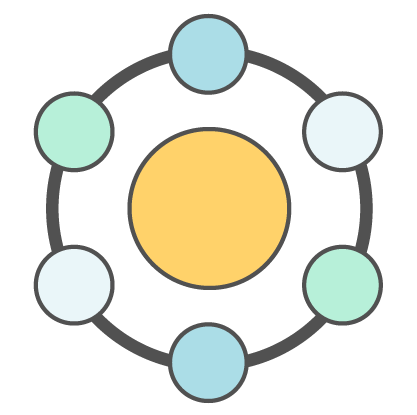

# Planman

## Project setup
*install packages*
```
yarn install
```
*setup environment variables*

`Place a .env file in your root directory.`

`See Grant Foster for file`

### Run Application Locally
*with hot-reload functionality!*
```
yarn serve
```

### Test Application
*push to any branch (other than master) to automatically run tests via Circle CI*
*to run tests locally...*
```
yarn test:unit
yarn test:e2e
```

### Deploy Development Application
*push to the development branch, circle ci will automatically build, test, and deploy the application to the development environment*


### Deploy Production Application
*push to the master branch, circle ci will automatically build, test, and deploy the application to the production environment*


### Deploy Development Application Locally
*if you wish to deploy to the development environment locally, run:*
```
yarn build
firebase use development 
firebase deploy
```